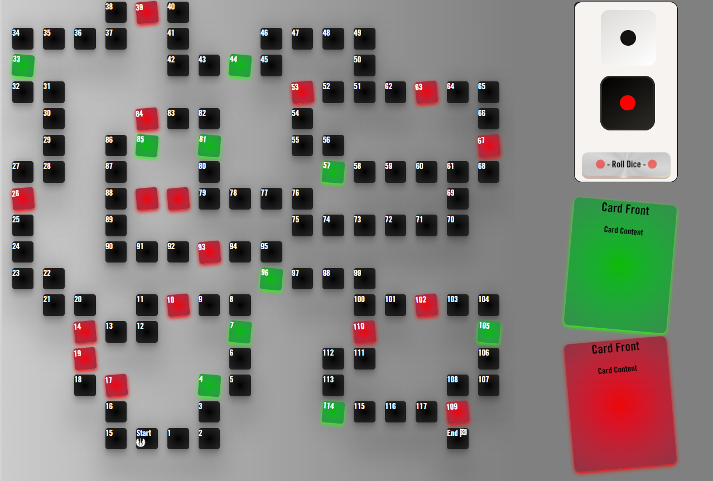

#  

#### Repo : https://github.com/chasakara/stg
#### Live Site : https://chaskara.github.io/stg/

## Description
An online board game developed by the **Jar Jar Jarverscripters** team during the weekend of the Star Wars Hackathon in May 2023.  We present a traditional multiplayer board game with 120 tiles. Here is our main board & we hope you enjoy playing it as nuch as we did building it!

#  Game

### Audience
This game is intended for people of all ages who may or may not have an interest in the Star Wars franchise.

### What to expect
On launching the game a challenge will be presented to you by video (option to skip if you are a frequest player), Your next option is to choose one of 2 buttons : the **Rules** or **Start** the game. 

The game starts by setting the number of players and then clicking/rolling the dice. If a player lands on a coloured tile they will be given a corresponding card - either a Force Card (good) or a Trap Card (bad) & have to reap the reward or take the punishment. First player to the end is the winner.  

### Controls
TODO: Explain Controls.
### Rules
TODO: Explain rules.
### Play
TODO: Add deployed link to game.

## Technical
This game was built with HTML, CSS & Javascript.

## Credits
Team Jar Jar JavaScripters
- Tinashe
- MiaRasmussen
- Ant_4P
- Joe Playdon
- Chris Grabham
- Anthony Radose
- Siobhan O'Brien
- Rhys Pegrume