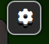

#  

#### Live Site : [https://chaskara.github.io/stg/](https://chasakara.github.io/stg/)

## Introduction
An online board called **Path to the Jedi Order** was developed by the **Jar Jar Jarverscripters** team during the weekend of the Star Wars Hackathon in May 2023.  We present a traditional multiplayer board game with 120 tiles, double dice, 2 types of chance cards & some surprise shortcuts along the way. This is our main board (without background) & we hope you enjoy playing it as much as we did building it!

### Audience
This game is intended for people of all ages who may or may not have an interest in the Star Wars franchise.

### What to expect
On opening the page a star wars themed video introduces your challenge (option to skip if you are a return players) 

Your next option is to choose one of 2 buttons to either **Start** the game or view the **Rules** 

The game starts by asking the players (max 4) to choose the Star Wars character they will adopt during the game. 

Play will continue with each player getting their turn to roll the dice with some surprises along the way depending where they land, for instance if a player lands on a coloured tile they will be given a corresponding card - either a Force Card or a Trap Card & have to reap the reward or take the punishment. Each player is prompted appropriately throughout the game until there is a winner & yep you have guessed it, the first player to the end is the **winner**.  

### Controls
Players can use the dice when its their turn

While in the main game you can click on the setting button to get into controls

Here you can control the video and launch the rules modal.

### Rules

### Future Plans
We have big plans to expland our game based on the planet you click on at the start

## Technical

This game was built using HTML, CSS & vanila Javascript. The code repository can be found at  https://github.com/chasakara/stg

## Credits

[Team Jar Jar JavaScripters](https://hackathon.codeinstitute.net/teams/309/)

- [MiaRasmussen](https://www.linkedin.com/in/mia-rasmussen-088091226/)
- [Ant_4P](https://github.com/Ant2210)
- [Joe Playdon](https://www.linkedin.com/in/joe-playdon-882a58231/)
- [Chris Grabham](https://www.linkedin.com/in/christopher-grabham-07778a266/)
- [Anthony Radose](https://www.linkedin.com/in/anthony-radose-35a969236/)
- [Siobhan O'Brien](https://www.linkedin.com/in/siobhan-o-brien/)
- [Rhys Pegrume](https://www.linkedin.com/in/rhys-pegrume-15b94a23b/)
- Tinashe

May 2023
